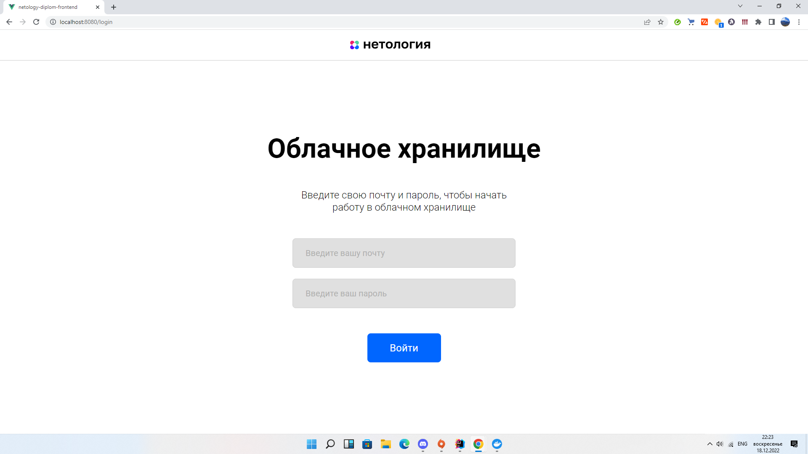
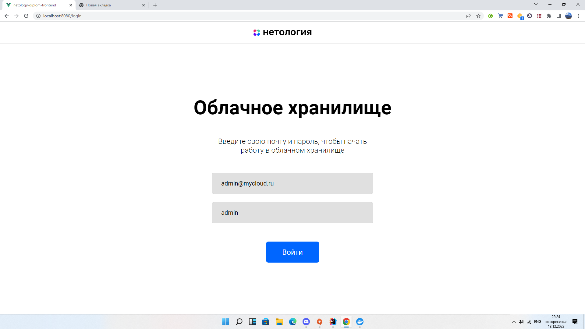

# Дипломная работа "Облачное хранилище"
Проект состоит из backend и frontend приложений. Backend написан на языке 
программирования Java на фреймворке Spring Boot. Backend и тесты на него находится в папке src,
Frontend в папке frontend

## Описание приложения

Backend приложение выполнено на языке Java и на фреймворке SpringBoot. Приложение покрыто Unit тестами с использованием
Mockito и интеграционными тестами на Docker контейнерах. Приложение использует СУБД MySQL.
Список пользователей и загруженные файлы хранятся в базах данных user и file. Для инициализации
баз данных используются миграции liquibase. Для удобной интеграции с приложением используется Hibernate и JPA Repository.
Для настройки авторизации используется фреймворк Spring Security.
Авторизация происходит по токену, а токен можно получить с помощью авторизации по почте и паролю.
Программа записывает логи в файл logs.log.


## Запуск

Frontend приложение запускается на порту 8080. Backend запускается на порту 8090. База данных на порту 3306.
Приложения имеют возможность упаковки в docker контейнеры. Для интеграции и удобного запуска сделан docker-compose.

### Как запустить приложение:

* Выполните команду:
```
  mvn package -DskipTests
```
* Затем выполните команду, которая запустит приложение:
```
docker-compose up
```

Для использования приложения перейдите на http://localhost:8080.

## Данные для авторизации



Для авторизации используйте следующие данные:

Email: admin@mycloud.ru

Пароль: admin



## Базы данных

В приложении используется СУБД MySQL. Для её использования используйте следующие данные:
url: jdbc:mysql://localhost:3306/cloud


Логин: root


Пароль: mysql

В программе используется 2 таблицы БД:

* user - для хранения пользователей. Поля email, password, auth_token.
* file - для хранения файлов. Поля file(в байтах), filename, size, email(пользователя)